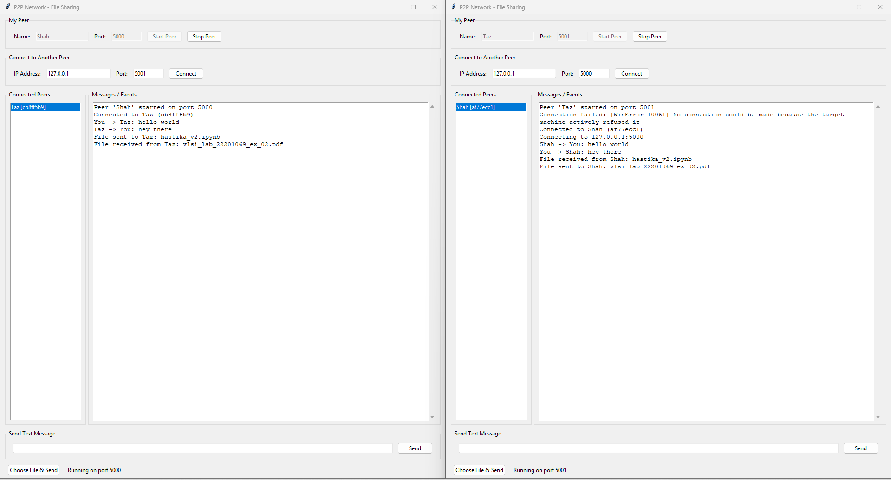
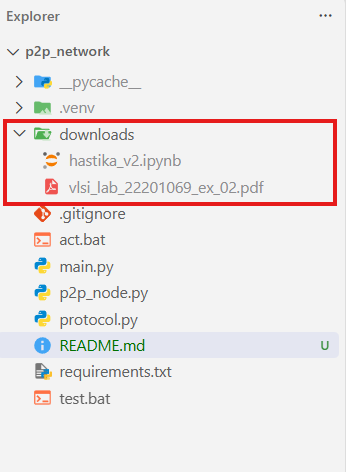

# Peer-to-Peer Network Communication and File Sharing

A desktop peer-to-peer (P2P) messaging and file-sharing application built with Python TCP sockets and Tkinter. Each running instance can accept incoming connections and connect to other peers. Peers communicate directly; the project does not use a central server.

## Features

- Start a peer with a custom name and listening port.
- Connect to another peer using its IP address and port.
- View connected peers and select a peer as the destination.
- Send text messages and files to a connected peer.
- Save received files in the `downloads/` directory, avoiding overwriting files with the same name.
- Handle network activity in background threads so the GUI remains responsive.

## Project structure

```text
p2p_network/
├── act.bat             # Activate the project's virtual environment in Command Prompt
├── main.py             # Tkinter GUI
├── p2p_node.py         # Peer connections, messaging, and file transfers
├── protocol.py         # Length-prefixed JSON control-message framing
├── README.md
├── requirements.txt    # Currently empty; there are no third-party dependencies
├── test.bat            # Open two application instances in separate Command Prompt windows
├── downloads/          # Destination for received files
└── .venv/              # Optional local virtual environment; not included in version control
```

The `.gitignore` file excludes the virtual environment, Python cache files, and received files inside `downloads/`.

## Requirements

- Python 3.8 or later.
- Tkinter. It is included with many Python installations; on some Linux distributions it must be installed separately.
- No third-party Python packages are currently required.

To check that Python and Tkinter are available, run:

```powershell
python --version
python -m tkinter
```

The second command should open a small Tk window. Close it before continuing.

## Setup

Open Command Prompt in the project directory. To use the project's existing virtual environment, activate it:

```bat
act.bat
```

`act.bat` runs `.venv\Scripts\Activate`. It assumes that the `.venv` environment already exists. If it does not, create it first:

```bat
python -m venv .venv
act.bat
```

Alternatively, use an installed Python directly and skip virtual-environment activation. There are no dependencies to install at this time, and `requirements.txt` is empty.

## Run the application

From the project directory, run:

```bat
python main.py
```

The project also includes a small automation script, `test.bat`, to launch two application instances for dual-peer testing.

To run the script, execute the following command from the project directory:

```bat
test.bat
```

The GUI opens with a default peer name and port. Enter a unique name and an available port, then click **Start Peer**. Keep the application open while communicating. Use **Stop Peer** to stop listening and disconnect peers.

## Connect peers on the same computer

To run two peers locally:

1. Start the application in one terminal and click **Start Peer** using port `5000`.
2. Start another application instance. Set its listening port to `5001`, then click **Start Peer**.
3. In the second instance, enter `127.0.0.1` as the IP address and `5000` as the remote port, then click **Connect**.
4. Select the connected peer in the list before sending a message or file.

Each instance listens on its own port. The peer you connect to must already be running and started.

## Use the batch helpers

### `act.bat`

Activates the existing `.venv` environment in Windows Command Prompt. If you create the environment yourself, run `python -m venv .venv` first. To keep the environment active in an existing Command Prompt, run `act.bat` from that prompt.

### `test.bat`

Opens two separate Command Prompt windows, each running `python main.py`. It does not start peers or configure their ports for you. In the two GUI windows, start the peers on different ports (for example, `5000` and `5001`), then connect one to the other as described above.

Run `test.bat` from an environment where `python` resolves to the Python interpreter you want the application to use. For the project's virtual environment, run it from the Command Prompt after activating `.venv`.

## Connect over a local network

For peers on different computers, connect both computers to a network that permits direct peer-to-peer connections. Start the receiving peer and use that computer's reachable IP address and listening port in the other peer's connection fields. A firewall may need to allow inbound TCP connections on the listening port.

The application does not provide Internet NAT traversal or automatic peer discovery. A peer must know the target IP address and port before connecting.

## Messaging and file transfer

Select a peer in **Connected Peers** before sending. Text messages appear in the recipient's **Messages / Events** log. For files, choose **Choose File & Send** and select a file; the recipient saves it under `downloads/`. If a file with the same name already exists there, a numbered name is used instead.

The protocol uses framed JSON for control messages and sends file contents as raw bytes over the established TCP connection. File transfers are handled in chunks.

## Troubleshooting

- **The peer will not start:** Check that the listening port is between `1` and `65535` and is not already in use. Choose another port if necessary.
- **The connection fails:** Confirm that the remote peer has started, that its IP address and port are correct, and that the network or firewall allows the connection.
- **The GUI does not open:** Verify that Python is installed and that its installation includes Tkinter. On Linux, install the distribution's Tkinter package if needed.
- **The batch file cannot find Python:** Activate the intended environment or ensure Python is available on `PATH`, then run the batch file from the project directory.

## Security and scope

This is a basic networking project, not a production-ready secure messenger. It does not implement encryption, authentication, or blockchain functionality. Do not use it to transfer sensitive data over untrusted networks.

## Screenshots


